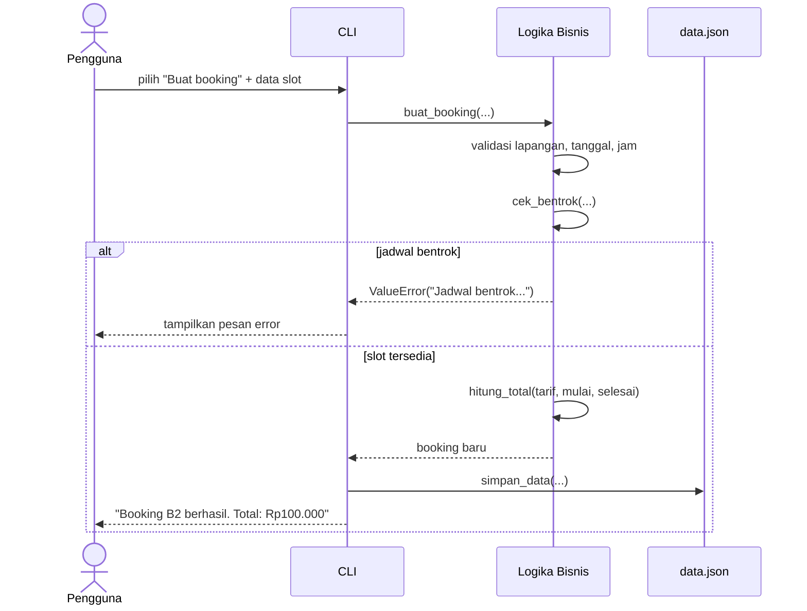
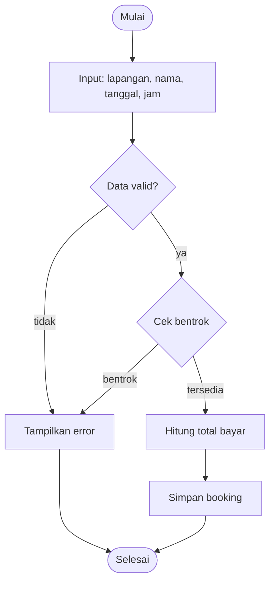

# Desain Sistem Booking Lapangan Futsal

## 1. Desain Arsitektur

Sistem memakai arsitektur 3 lapis sederhana:

```
┌─────────────────────────┐
│   CLI (menu interaktif) │  <- interaksi pengguna (main, _tampil_*)
├─────────────────────────┤
│     Logika bisnis       │  <- cek_bentrok, hitung_total, buat_booking,
│                         │     batalkan_booking, tambah_lapangan, jadwal_tanggal
├─────────────────────────┤
│   Penyimpanan (JSON)     │  <- muat_data / simpan_data ke data.json
└─────────────────────────┘
```

- **CLI** hanya mengurus input/output, tidak menyimpan state.
- **Logika bisnis** murni fungsi tanpa I/O — mudah di-unit-test.
- **Penyimpanan** satu file `data.json` berisi daftar lapangan & booking.

## 2. Use Case

Aktor: **Pengguna** (satu peran).

| ID | Use case | Deskripsi |
|----|----------|-----------|
| UC-01 | Lihat lapangan | Menampilkan daftar lapangan + tarif/jam |
| UC-02 | Tambah lapangan | Menambah lapangan baru (nama, tarif > 0) |
| UC-03 | Buat booking | Memesan slot: sistem menolak jika bentrok |
| UC-04 | Lihat jadwal | Menampilkan booking aktif per tanggal |
| UC-05 | Batalkan booking | Mengubah status booking menjadi "batal" |

Relasi: UC-03 membutuhkan UC-01 (memilih lapangan yang ada).

## 3. Sequence Diagram — Buat Booking



## 4. Activity Diagram — Buat Booking



## 5. Keputusan desain penting

- **Aturan bentrok**: dua rentang `[mulai, selesai)` bentrok jika
  `mulai1 < selesai2 dan mulai2 < selesai1`. Booking yang selesai tepat
  saat booking lain mulai **diperbolehkan** (batas bersentuhan).
- **Booking yang dibatalkan** diabaikan saat cek bentrok — slotnya bebas lagi.
- **Total proporsional per menit**: 90 menit × Rp60.000/jam = Rp90.000.
